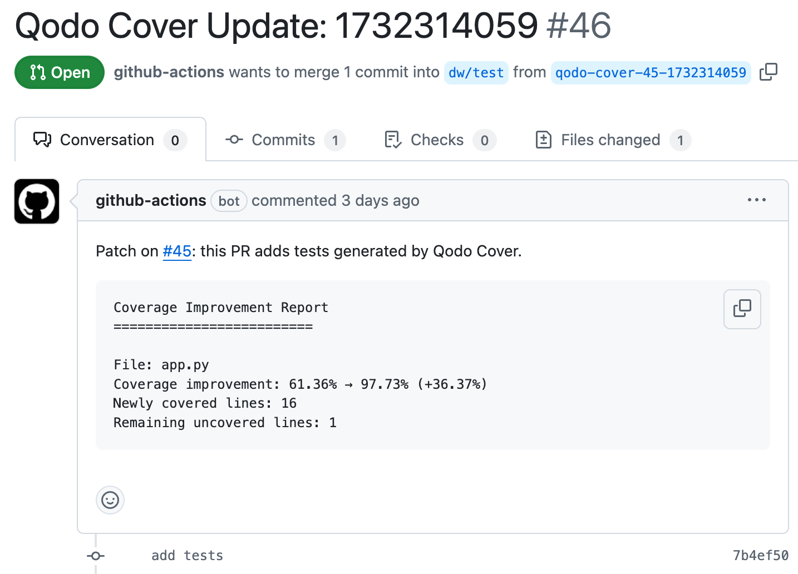

# Qodo Cover GitHub Action (coming soon! 🚀)

Automatically generate and enhance test coverage using AI-powered test generation. Qodo Cover analyzes your existing test coverage and intelligently generates additional tests to improve coverage while ensuring high-quality, meaningful test cases.

## Features

* 🔍 Analyzes existing test coverage to identify gaps
* 🤖 Uses AI to generate contextually aware test cases
* ✅ Ensures generated tests execute successfully and pass assertions
* 📈 Targets uncovered code paths to maximize coverage
* 🔄 Iterative test generation with configurable attempts
* 🎯 Configurable coverage threshold

## Usage

Copy this [working example] or add the following to your workflow:

```yaml
name: Run Qodo-Cover

on:
  pull_request:
    branches:
      - main
    types:
      - opened # Trigger only when a pull request is opened

permissions:
  pull-requests: write # Allows commenting on pull requests
  contents: write # Allows reading and writing files

jobs:
  run-qodo-cover:
    runs-on: ubuntu-22.04
    steps:
      
      ... # Set up your python test environment

      - name: qodo-cover
        uses: Codium-ai/qodo-cover/.github/actions/qodo-cover@v0.1.0
        with:
          github_token: ${{ secrets.GITHUB_TOKEN }}
          project_language: python
          project_root: <path/to/your/python/project>
          code_coverage_report_path: <path/to/your/coverage.xml>
          test_command: "pytest --cov=. --cov-report=xml --cov-report=term"
          model: gpt-4o

        env:
          OPENAI_API_KEY: ${{ secrets.OPENAI_API_KEY }}
```

### Inputs

| Input | Description | Required | Default |
|-------|-------------|----------|---------|
| `github_token` | GitHub token for authentication | Yes | N/A |
| `project_language` | Programming language of the project | No | `python` |
| `project_root` | Root directory of the project | No | `.` |
| `code_coverage_report_path` | Path to the coverage.xml file | No | `./coverage.xml` |
| `test_command` | Command to run tests (must generate coverage.xml) | Yes | N/A |
| `model` | LLM model name | No | `gpt-4o` |
| `max_iterations` | Maximum test generation attempts per file | No | `3` |
| `desired_coverage` | Target coverage percentage | No | `100` |

### Repository secret

Add `OPENAI_API_KEY` to your [repository secrets](https://docs.github.com/en/actions/security-for-github-actions/security-guides/using-secrets-in-github-actions#creating-secrets-for-a-repository).

**Note:** This requirement is temporary. We will enable users to issue access tokens from their Qodo Portal in a future release.

### Workflow permissions

For this action to work you must explicitly allow GitHub Actions to create pull requests. This setting can be found in a repository's settings under Actions > General > Workflow permissions.

## Outputs

If the Qodo Cover agent succeeds in improving coverage it will comment on your PR with a link to a patch PR containing the new tests.



## Limitations

* Must run on ubuntu-22.04 x64
* Will only add test cases to existing Python unit test files
* Your GitHub workflow must be able to generate coverage reports in Cobertura XML format (e.g. with pytest and pytest-cov)
* You must provide your own OpenAI API key

## Roadmap

- [ ] Support QodoAI auth so user doesn't have to bring their own LLM API key
- [ ] Option to only generate tests that are focused on the user's PR changeset
- [ ] Integration with Qodo Merge and Qodo Gen
- [ ] Support for additional languages (Typescript, Golang, Java, etc.) and coverage formats (e.g. Cobertura, Clover, JaCoCo)
- [ ] Support workflows for other CI providers (Jenkins, CircleCI, Travis CI, and more)

